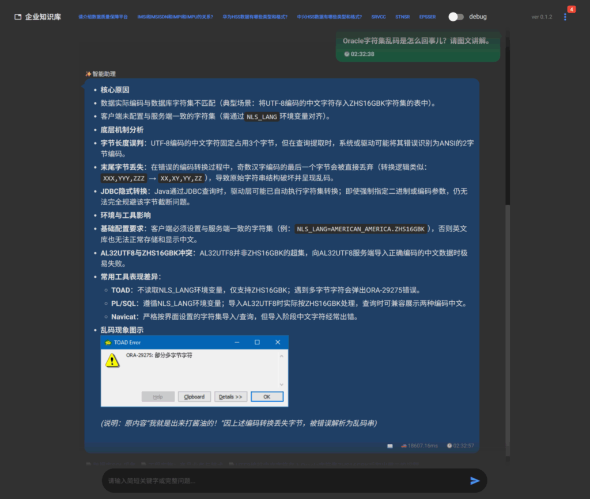

# 项目简介
[](https://blog.csdn.net/ddrfan?type=blog)
[](https://space.bilibili.com/688222797)

**简体中文** | [English](README_en.md)

## 这是在干啥
> [!Note]
我像这只小猫，从0学习和理解企业知识库和RAG的知识。  
目标是建立电信\移动支撑网络企业的知识库问答系统，召回正确率高，响应速度快，能追溯到原文。  
基于安全因素，本地不联网的情况下。  
>
> 项目基于LlamaIndex，但随着开发深入，为了解决具体的问题，
逐渐开始将LlamaIndex的组件换成自定义组件。  
同时为了在项目内实现文档转换，加入了Docling的依赖。


## ⭐项目功能

### （1）转换原始文档

1. 转换原始文档为Markdown格式的参考文档
   * 将原始文档中的图片保存为外部独立图片文件，并在参考文档中重新引用
2. 对参考文档文件修正和加强
   * 对markdown文件进行表格，列表，等格式方面的修正
   * 对文档中引用的图片进行LLM识别，添加图像描述数据块
   * 考虑到原始文档可能已经是markdown格式，人工可手动拷入修改。所以数据修正图片识别都在索引阶段进行

### （2）建立知识库

1. 建立RAG所需的向量数据库，数据保存在 `项目/storage/chroma_db/` 目录中
   * 自定义解析器对Markdown文件进行基于标题正文结构的分块（chunking）
   * 对大型表格块进行保留表头的拆分。
   * 对大型文本块进行基于段落和换行的拆分
   * ⚠️ 超长数据暂未能完全处理！！！_注意观察，chunk可能依旧超长（进行中……）_
   * 对于并列章节内容的小块进行合并
   * 对于分块增加必要的元数据，进行章节标题注入。
   * 根据规则，对元数据进行加强（enrich）（查询尚未使用，考虑中……）
1. 支持快速检索字典，数据放在 `项目/storage/dict/` 目录中。请手动把文本文件拷贝进去，不是程序自动完成的
   * 支持用tab作为分隔符的文本文件，每行一个词条。
   * 首字段是词条`关键词`，随后的多个字段是该关键词的`释义`
   * 支持重复的词条关键字，也就是多行文本在解释同一个词
   * 这部分是考虑到行业特点加进去的。专业术语、字段结构……
   
### （3）查询检索

1. 字典快速查询检索
   * 对于单个词语（单词）先进行毫秒级别的字典检索
   * 可用简单的语句同时检索多个关键字（比如：`CW和hold是什么？`,`IMPI IMPU IMSI MSISDN`）
   * 字典未命中直接RAG，命中则询问是否继续RAGRAG检索（仅WEB）
1. 向量数据库检索
   * 可选在线或本地LLM，可配置大小LLM分别处理不同工作
   * 用户意图识别和关键字加强，提高召回精度，更好的回答方式
   * 使用LLM语义和BM25关键词的混合检索，重排序，动态选择，严格匹配补充
   * 采用答案缓存加速检索，数据保存在 `项目/storage/cache/` 目录中（可考虑召回缓存……）
1. 检索查询界面
   * 支持WEBUI网页界面和CLI的查询检索。
   * 答案显示参考文档，可阅读全文，并高亮显示引用片段位置，支持引用图片显示。
   * 可以从`参考文档`定位到`原文pdf`，进行更加深入的浏览。 
1. 调试和反馈
   * 这个项目是给大家做RAG的参考，没人真的直接用吧？
   * CLI可选进一步打印召回信息。
   * WEB有调试面板，显示简单的召回信息。
   * 如有必要，请自行修改代码增加调试信息，或反馈给我。


## ⭐安装
我自己用的环境是`python 3.10`，没测试过新的python版本。

1. 将仓库代码克隆到一个本地目录： 
`git clone https://github.com/ShionWakanae/llamaIndexSample.git`
1. 进入这个目录建立虚拟环境：`python -m venv venv`
2. 激活虚拟环境：`.\venv\scripts\activate`
3. 安装CUDA依赖：`pip install -r requirements_cuda.txt`  (如果使用CUDA加速)
4. 安装依赖：`pip install -r requirements.txt`

💡可选但最好安装[Libre Office](https://zh-cn.libreoffice.org/download/libreoffice/)程序，并加入系统路径。

## ⭐使用
### ℹ️（0）参数配置

将`.env_sample`拷贝成`.env`，并修改其中的API地址密钥，各种模型配置（本地或在线），其它参数可保留原样，后根据实际情况修改，配置样例如下：
``` ini
STORAGE_SECRET=xxxxxx                       #输入任意的固定字符串

LLM_API_BASE=https://api.openai.com/v1      #本地或在线的OpenAI或兼容API地址
LLM_API_KEY=sk-xxxxx                        #密钥
LLM_MODEL=gpt-4.1-mini                      #模型名称
LLM_MODEL_SMALL=                            #小模型名称，留空代表不另外设置（用于查询重写和用户意图）

VISION_API_BASE=https://api.openai.com/v1   #视觉API地址
VISION_API_KEY=sk-xxxxx                     #密钥
VISION_MODEL=qwen3.6-flash                  #模型名称

EMBEDDING_MODEL=BAAI/bge-m3                 #可以不修改，自动从hf上下载。
EMBEDDING_DEVICE=cuda                       #默认设备为cuda，也可以设置为cpu
RERANKER_MODEL=BAAI/bge-reranker-v2-m3      #可以不修改，自动从hf上下载。

CHUNK_SIZE=1024                             #分块大小。
CHUNK_OVERLAP=80                            #分块重叠区间。

RETRIEVAL_VECTOR_TOP_K = 15                 #向量召回数量。
RETRIEVAL_BM25_TOP_K = 15                   #BM25召回数量。
VECTOR_SIMILARITY_TOP_K = 30                #相似内容召回数量。

RETRIEVAL_RERANK_TOP_N = 5                  #重排序后召回数量。
RETRIEVAL_RERANK_TOP_N_MAX = 10             #最大扩展召回数量。

APP_DOC_PATH = c:\app_doc                   #应用文档路径，必须配置（内有ref_md参考文档目录，ori_pdf原始文档目录）。
WEBUI_USERNAME=janedoe                      #WebUI用户名
WEBUI_PASSWORD=123456                       #WebUI密码

HOST=127.0.0.1                              #WebUI主机地址
PORT=7860                                   #WebUI端口
```
💡关于显卡加速：

没有N卡请修改`EMBEDDING_DEVICE=cuda`，改为`cpu`。  
有Nvidia显卡，请安装CUDA版本的Pytorch，如果你刚才安装了CPU版本的Pytorch，需要先卸载再安装：
``` shell
pip uninstall torch torchvision torchaudio
pip install torch torchvision torchaudio --index-url https://download.pytorch.org/whl/cu128
```
如果对CUDA版本有疑问，请参考:[关于CUDA版本的说明](./doc/cuda.md)。

### ℹ️（1）文档转换
> 若转换效果不佳，可自行尝试微软的 [markitdown](https://github.com/microsoft/markitdown)，或者 [pymupdf4llm](https://github.com/pymupdf/PyMuPDF4LLM)，[marker](https://github.com/datalab-to/marker) 等等……
> 

将docx/pdf等文档提取图片并带目录结构转换为md并存储到`APP_DOC_PATH`的`ref_md`目录下。  
如果是pdf文档可选择复制到`APP_DOC_PATH`的`ori_pdf`目录下。
也可以手动把已经转换好的md文件放到`APP_DOC_PATH`的`ref_md`目录下。

``` shell
python .\src\convert_cli.py "input_path"
```
每次添加修改文件后，需要重新索引知识库，查询缓存也将失效（见下一步）。

### ℹ️（2）建立知识库
索引`APP_DOC_PATH`中`ref_md`目录下的`.md`类型的文件：  

建议先通过debug参数，观察这批文档的修正，图片识别，分块的情况，确认没问题再正式索引：  
``` shell
python .\src\index_cli.py --debug    #只会预处理文档，打印日志，不会索引向量
```
``` shell
python .\src\index_cli.py
```


CPU和CUDA速度对比：
```yml
i9-12900F * Generating embeddings: 100%|█████████████████████| 582/582 [06:45<00:00, 1.43it/s] 
4060TI16G * Generating embeddings: 100%|█████████████████████| 582/582 [00:30<00:00, 19.26it/s]
```

### ℹ️（3）查询知识库
#### 命令行查询
``` shell
python .\src\rag_cli.py '你的问题'
```
#### 浏览器查询
1. 启动WebUI服务。
``` shell
python .\src\reg_webui.py
```
2. 打开浏览器，访问`http://127.0.0.1:7860/` 发送问题进行知识库的查询。  
页面下方输入框中输入问题，上方是聊天记录。  
点击一个`.md`参考文件，弹出对话框浏览文件内容。  
右边是调试信息，时长和命中情况。看更详细的信息请用CLI。  
PS: 手机平板也可访问。



## 视频演示
点击打开B站视频：

[](https://www.bilibili.com/video/BV1mk5i6nEsQ) [](https://www.bilibili.com/video/BV1s15i6EEQr)  

还有更多的视频更新，有需要请站内自行查看。


## 技术栈
[](https://www.reddit.com/r/LlamaIndex/)


## 环境支撑


## 授权许可
 

> [!Important]
> 本项目基于MIT许可证开源，您可以在遵守许可证条款的前提下自由使用、修改和分发本项目的代码。

重要的第三方库:
- Docling (MIT)
- LlamaIndex (MIT)
