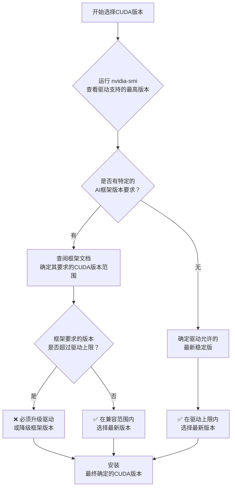

# 关于CUDA版本

> I'm sorry there is no English version of this document.

请参考中文版本。
如果你对CUDA有疑问。
建议可查看[官方的GPU计算能力页面](https://developer.nvidia.com/cuda/gpus)。
以及[官方的CUDA编程指南 - 附录（技术规格详情）](https://docs.nvidia.com/cuda/cuda-c-programming-guide/index.html#compute-capabilities)。

我知道，内容太多了看不下去，所以我总结如下：

## （一）驱动程序的CUDA版本

请先安装Nvidia的驱动程序。
然后命令行运行 `nvidia-smi` 检查你的显卡是否被正确识别，检查驱动支持的CUDA版本。
如果你不怎么更新驱动程序，至少显示的CUDA版本要大于下面内容提到的最低所需版本。

例如我的驱动CUDA支持是`13.2`版本，记住这个数字（最高）:

```shell
PS C:\> nvidia-smi
Mon May 11 13:31:35 2026
+-----------------------------------------------------------------------------------------+
| NVIDIA-SMI 596.36                 Driver Version: 596.36         CUDA Version: 13.2     |
+-----------------------------------------+------------------------+----------------------+
| GPU  Name                  Driver-Model | Bus-Id          Disp.A | Volatile Uncorr. ECC |
| Fan  Temp   Perf          Pwr:Usage/Cap |           Memory-Usage | GPU-Util  Compute M. |
|                                         |                        |               MIG M. |
|=========================================+========================+======================|
|   0  NVIDIA GeForce RTX 4060 Ti   WDDM  |   00000000:01:00.0  On |                  N/A |
|  0%   37C    P8             11W /  165W |    1459MiB /  16380MiB |      0%      Default |
|                                         |                        |                  N/A |
+-----------------------------------------+------------------------+----------------------+
```

## （二）显卡支持的最低CUDA版本

检查自己的显卡，如果你的CUDA工具包低于下表的最低所需版本，你需要升级CUDA工具包。
太老的显卡会存在支持的上限，但主流显卡只有下限没有上限。

对于专业显卡，你都买专业卡了不可能不懂这些……
消费级显卡和对应的最低所需CUDA版本如下：

| 显卡系列 | 代表型号 | 显卡架构 (NVIDIA Architecture) | 计算能力 (CUDA Capability) | 最低所需 CUDA 版本 |
| :--- | :--- | :--- | :--- | :--- |
| **GeForce RTX 50 Series** | RTX 5090, 5080, 5070 Ti, 5070, 5060 Ti, 5060 | Blackwell | 12.0 | CUDA 12.0 或更高版本 (建议 12.8+) |
| **GeForce RTX 40 Series** | RTX 4090, 4080, 4070 Ti, 4070, 4060 Ti, 4060 | Ada Lovelace | 8.9 | CUDA 11.8 或更高版本 |
| **GeForce RTX 30 Series** | RTX 3090 Ti, 3090, 3080 Ti, 3080, 3070 Ti, 3070, 3060 Ti, 3060 | Ampere | 8.6 | CUDA 11.1 或更高版本 |
| **GeForce RTX 20 Series** | RTX 2080 Ti, 2080, 2070, 2060 | Turing | 7.5 | CUDA 10.0 或更高版本 |

例如我的显卡CUDA支持最低是`11.8`版本，记住这个数字（最低）:

## （三）安装CUDA工具包
如果还没有工具包，请从[官方网站下载](https://developer.nvidia.com/cuda-toolkit-archive)。

安装好CUDA工具包后，请运行命令 `nvcc --version` 确认版本。
例如我的CUDA工具包版本是`12.8`版本，记住这个数字（最后一个数字）:

```shell
PS C:\> nvcc --version
nvcc: NVIDIA (R) Cuda compiler driver
Copyright (c) 2005-2025 NVIDIA Corporation
Built on Wed_Jan_15_19:38:46_Pacific_Standard_Time_2025
Cuda compilation tools, release 12.8, V12.8.61
Build cuda_12.8.r12.8/compiler.35404655_0
```

## （四）简单总结



需要保证：`驱动支持CUDA版本` >= `CUDA工具包版本` >= `显卡最低支持版本`

以自己为例：`13.2` >= `12.8` >= `11.8`

用中间的版本数字，去安装Pytorch的CUDA版本，比如我自己：
``` shell
(venv)...> pip uninstall torch torchvision torchaudio
(venv)...> pip install torch torchvision torchaudio --index-url https://download.pytorch.org/whl/cu128
```